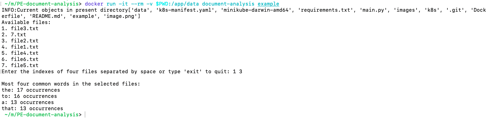

# Document Analysis Program

This program analyzes a set of text documents and returns the most 4 common words.

## Requirements

- Docker
- K8s cluster

## Usage

1. Clone the repository:

   ```bash
   git clone https://github.com/Vishnu4pods/PE-document-analysis.git
2. Go the repository directory
   ```bash
   cd PE-document-analysis
3. Build image locally
   ```bash
   docker build -t document-analysis .
4. Run the image 
   ```bash
   docker run -it --rm -v <data-stored-path>:/app/data document-analysis <folder-path-to-be-searched>
   e.g    docker run -it --rm -v $PWD:/app/data document-analysis example


   

## How to use the application

Select the index of the files separated by space.



##K8s

:exclamation: To test on k8s, make sure k8s is able to pull the image locally otherwise you will need to upload it in dockehub or some image repository
1. Install cluster
   See: https://opensource.com/article/20/11/run-kubernetes-locally 
   If using minikube: 
   Set the environment variables with eval $(minikube docker-env)
   Build the image with the Docker daemon of Minikube (e.g., docker build -t my-image .)
   
2. From the repository directory, run the following command
   ```bash
   helm upgrade --install <release name > ./k8s/ -f ./k8s/values.yaml --namespace <nmespace_name> --create-namespace=true
